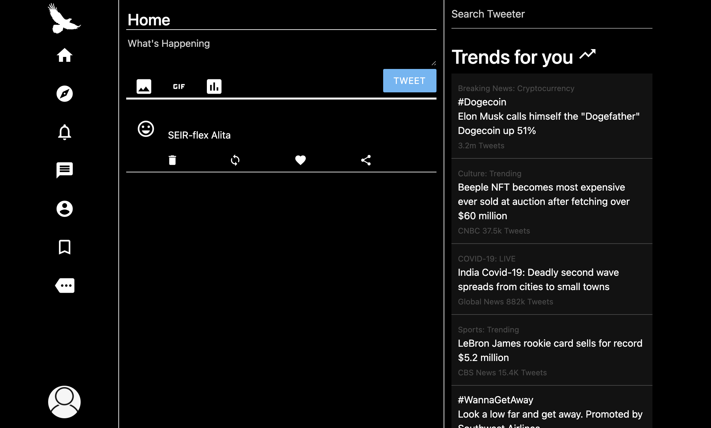
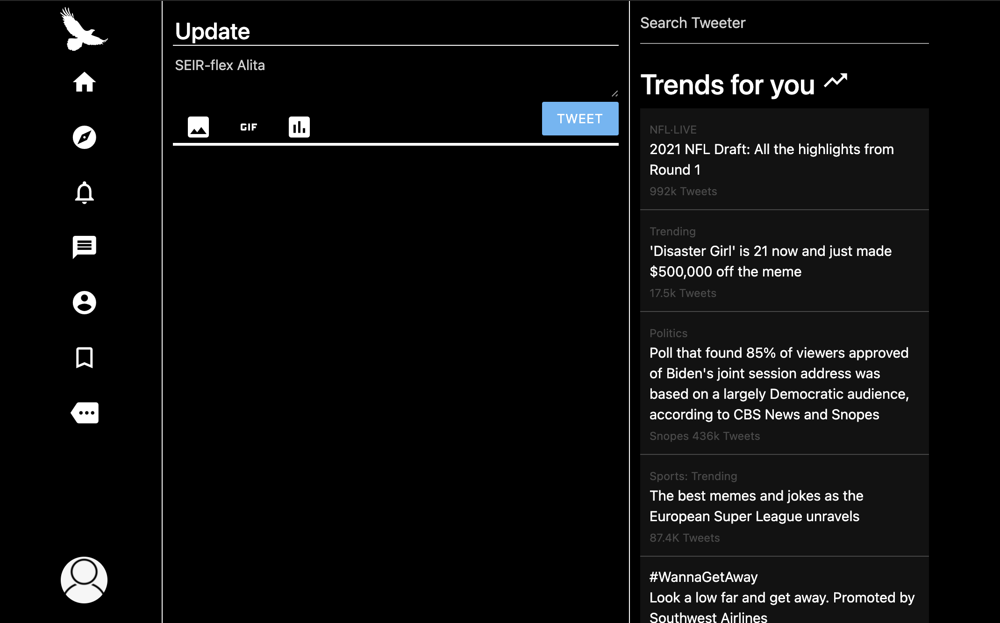

# Tweeter

A blogging and social network app that allows users to post and interact with messages.

## Technologies
- Node.js
- Express.js
- MongoDB
- Mongoose
- HTML
- CSS
- Javascript
- Materialize CSS

## Screenshots

## Wireframes

## ERDs

## Getting Started
[Click Here](https://tweeter-alita.herokuapp.com/posts) to get started

## Future Enhancements
- Allow users to signup/login to an account through OAuth
- Allow the Trending column to display live and trending news
