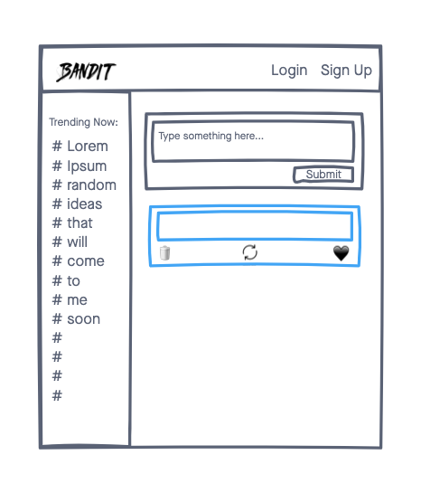
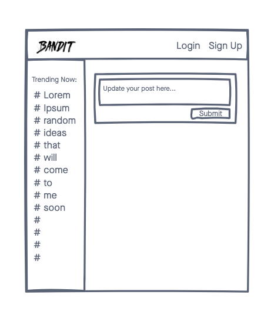

# Project Bandit

A blogging and social network app that allows users to anonymously post messages. Registered users can post and like posts and update their own posts.

## Technologies
- CSS3
- Node
- Express
- Mongoose

## Wireframes

## Getting Started
[Click Here](https://github.com/jchoi192/project-bandit) to get started

## Future Enhancements
- Allow users to signup/login to an account
- Allow the Trending aside to display actual hashtags that are trending within the app
